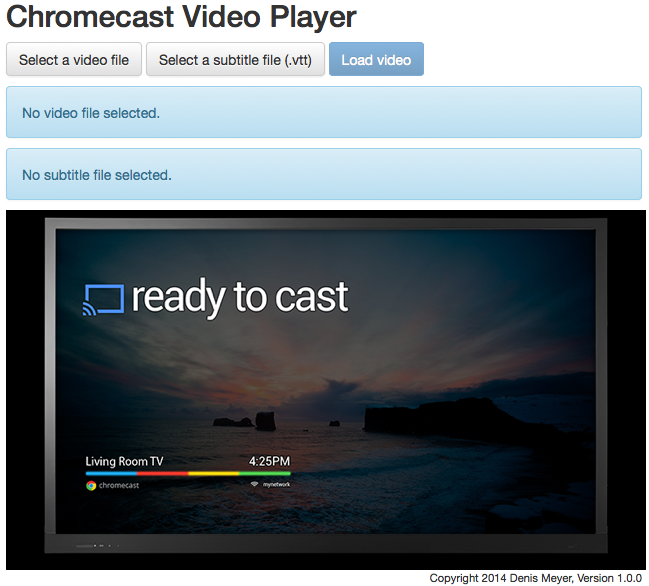
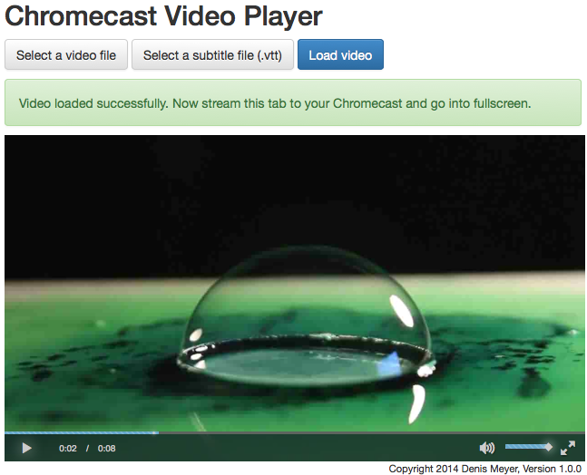

Chromecast Video Player
=====

# Copyright
2014 Denis Meyer

# License
GNU General Public License v2.0
For more information see file "LICENSE"

# Version
1.0.0

Watch your local videos on your Chromecast.

Step 1 - Set up and configure your (local) web server
-----
1. Set up a (local) web server
  - e.g. via MAMP (Mac OS X)
2. Put the Chromecast Video Player Source-Code (/src) into your web server directory
3. Start your web server

Step 2: Load a video (and subtitles)
-----
1. Browse to you web server URL
  - You should see the following:

  

2. Upload a video source file and a subtitle source file [optional]
3. Load the video
  - You should see the following:

  

4. Start casting to your Chromecast
5. Go fullscreen
